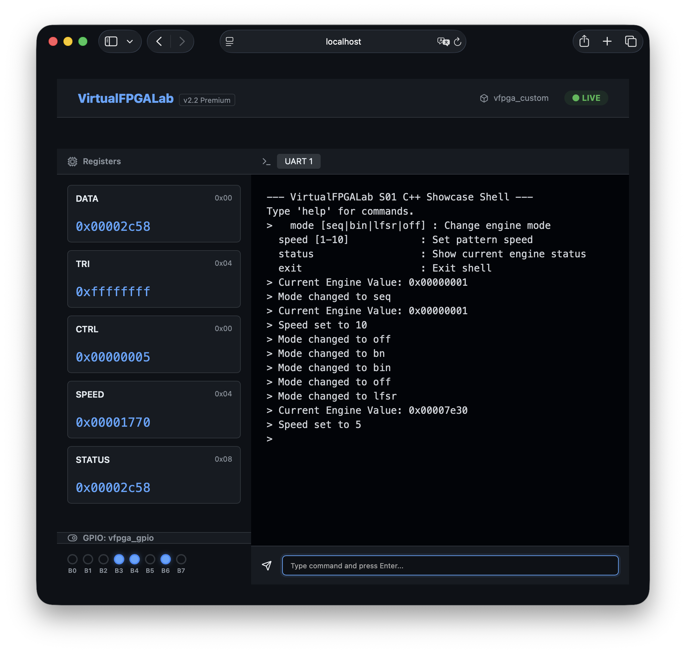

# VirtualFPGALab

VirtualFPGALabは、FPGAを搭載した実機や評価ボードが無い環境でもFPGAで提供されるデバイスを操作するファームウェアの開発を行えるようにするための環境です。Linuxのシステムコールをインターセプトし、エミュレートしたFPGAのデバイスへリダイレクトすることで、あたかも物理的なFPGAを操作しているかのような開発体験を実現します。

## 主な機能

- **DTS駆動の自動生成**: Device Tree Source (`.dts`) をソースとして、Shim（インターセプト層）、RTLスケルトン、コンフィグレーションヘッダを自動生成します。
- **アプリケーション透過性**: [LD_PRELOAD](AddInfo_LD_PRELOAD.md) を用いたShimにより、`open`, `mmap`, `ioctl` などのハードウェアアクセスをエミュレートします。アプリケーション側のソースコード修正は一切不要です。
- **RTL統合シミュレーション**: [Verilator](AddInfo_verilator.md) を用いた高速なRTLシミュレーションをサポートし、共有メモリ経由でレジスタ値を同期します。
- **共有メモリバックエンド**: `/dev/shm` を使用し、CPUとシミュレーションロジック間の低レイテンシなレジスタ通信を実現します。
- **Webダッシュボード**: Webベースのインターフェース（ポート 8080）を介して、レジスタ状態をリアルタイムで監視できます。
  

## プリリクエスト

動作には以下のツールが必要です：
- GCC / G++
- Make
- Python 3.10+ (Flask, Flask-CORS)
- Verilator
- (推奨) VS Code + Dev Containers 拡張機能

## クイックスタート

### 1. ビルドとテストの実行
自動テストランナーを使用して、環境の動作確認を一括で行えます：

```bash
./tests/run_tests.sh
```

### 2. 対話モードとダッシュボードの利用
シミュレーションを維持し、Webダッシュボードで状態を確認する場合：

```bash
./tests/run_tests.sh --interactive
```
実行後、ブラウザで `http://localhost:8080` にアクセスしてください。

### 3. クリーンアップ
```bash
./tests/run_tests.sh --clean
```

## Dockerでの実行

Antigravity以外の環境（通常のターミナルなど）からDockerを使用して動作確認を行うことも可能です。

### 1. 環境の起動
プロジェクトのルートディレクトリで以下のコマンドを実行します：

```bash
docker compose up -d
```

これにより、ビルド、テストの実行、およびダッシュボードサーバーの起動が自動的に行われます。

### 2. ダッシュボードへのアクセス
ブラウザで `http://127.0.0.1:8080` にアクセスしてください。

### 3. コンテナ内でのコマンド実行
コンテナが起動している状態で、別のターミナルからコンテナ内に入ってテストを実行したり、デバッグしたりすることができます：

```bash
docker compose exec lab bash
```

### 4. 終了
`Ctrl+C` で停止するか、以下のコマンドを実行します：

```bash
docker compose down
```

## プロジェクト構成

- `src/shim/`: システムコールインターセプト層（自動生成）
- `src/rtl/`: Verilogソースファイル（スケルトンは自動生成）
- `src/sim/`: Verilator用C++シミュレーションラッパー
- `src/controller/`: Pythonバックエンド管理およびダッシュボードサーバー
- `tests/`: テストアプリケーションおよびDevice Tree設定
- `scripts/`: 生成スクリプトおよびユーティリティ

## 詳細ドキュメント

プロジェクトの設計思想や技術仕様の詳細については、以下のドキュメントを参照してください。

- **[技術仕様書 (spec.md)](spec.md)**: 各コンポーネントの機能詳細とインターフェース定義。
- **[アーキテクチャ・マニフェスト](ARCHITECTURE_MANIFEST.md)**: プロジェクトの設計原則と主要な決定事項の記録。

## ライセンス

本プロジェクトは、[LICENSE](LICENSE) ファイルに記載された条件の下でライセンスされています。
