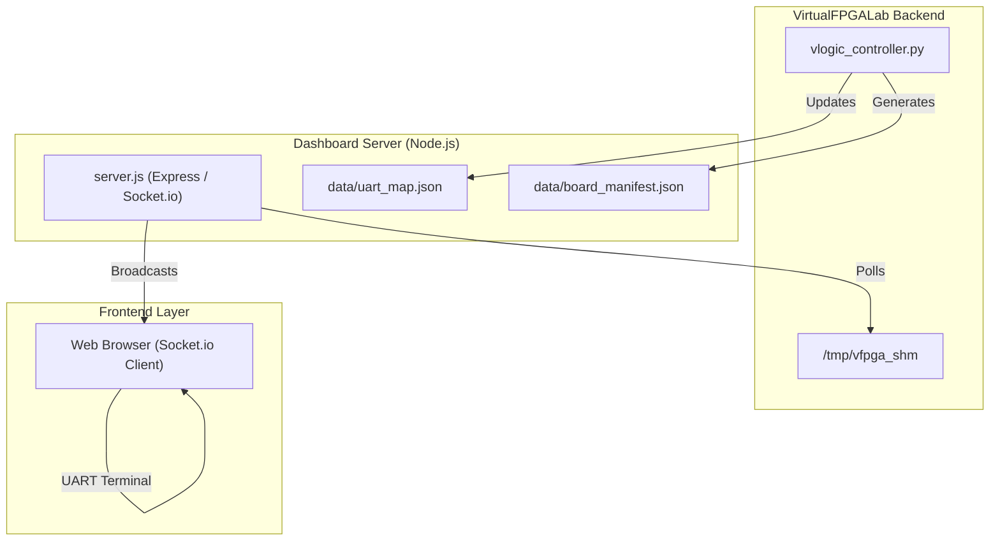

# dashboard/ - 仮想 FPGA 診断ダッシュボード

このディレクトリには、仮想 FPGA の内部レジスタ状態をリアルタイムに監視し、UART コンソールへのアクセスを提供する Web ベースの診断インターフェースが収められています。

## 役割 (Role)

- **リアルタイム監視**: 共有メモリ (SHM) を監視し、RTL シミュレータ上のレジスタ値をダッシュボードへブロードキャストします。
- **UART ブリッジ統合**: 複数の UART デバイス（PTY/TCP ブリッジ）を集約し、ブラウザ上のターミナルから操作可能にします。
- **自動化 (Macros)**: `login:` 等の特定の文字列を検知して自動的にレスポンスを返すマクロ機能を備えています。

## アーキテクチャ図



## 主要なファイル

- **`server.js`**: ダッシュボードのバックエンドエンジン。
    - ポート 8080 で待機。
    - マニフェストと共有メモリを読み取り、WebSocket (`socket.io`) でフロントエンドに配信。
    - UART ブリッジ（TCP ポート 2000〜）との中継を担当。
- **`client/`**: フロントエンドのソースコード。
- **`data/`**: 動的に生成されるマニフェストや UART マップファイルの格納場所。

## 使用方法

通常、`start_lab.sh` によって自動的に起動されますが、手動で起動する場合は以下の手順に従います。

```bash
cd dashboard
npm install
node server.js
```

ブラウザで **`http://localhost:8080`** を開くとダッシュボードにアクセスできます。

## API エンドポイント

- `GET /api/manifest`: 現在ロードされているボード構成情報を返します。
- `GET /api/uart/logs`: 全ての UART の直近のログを取得します。

## 設計上の配慮 (Design Philosophy)

1. **Backend Decoupling**: Python 側の制御ロジックと Node.js 側の可視化ロジックを分離することで、UI 側の操作がシミュレーションのリアルタイム性に影響を与えないように設計されています。
2. **Auto-Discovery**: `data/board_manifest.json` を監視し、新しいデバイスが追加されるとダッシュボードへ自動的に反映されます。
