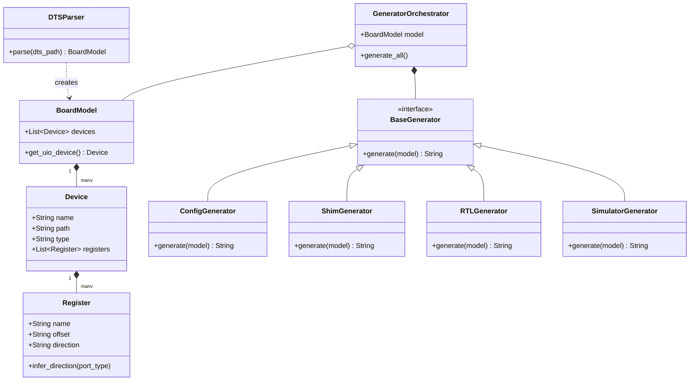

# gen_vfpga.py リファクタリング設計書

## 1. 現状の課題とリファクタリングの目的

### 1.1 現状の課題（技術的負債）
- **密結合な同期ロジック**: `sim_main.cpp` が「書き込み検知」と「読み出し反映」を同一サイクルで無条件に行うため、ソフトウェアの書き込みが RTL の古い値で上書きされるレースコンディションが発生している。
- **モノリシックな生成処理**: `gen_vfpga.py` 内で、DTS のパースから C/C++/Verilog の生成までが一つのファイルに混在しており、新しいデバイス（SPI, DMA等）の追加が困難。
- **レジスタ属性の欠如**: 全てのレジスタを一律に Read-Write として扱っており、ハードウェア特有の「Read-Only」や「Write-Only」といった振る舞いを定義できない。

### 1.2 リファクタリングの目的
- **同期の正当性確保**: バス・トランザクションをモデル化した確実な同期プロトコルの導入。
- **拡張性（疎結合化）**: 生成対象（Header, Shim, RTL, Simulator）をモジュール化し、デバイスタイプごとに生成ロジックをプラグイン可能にする。
- **実機再現性の向上**: 実機の AXI バス等の挙動を抽象化したブリッジ層の導入。

---

## 2. 新アーキテクチャ案

### 2.1 内部データモデルの導入 (Board Model)
DTS の解析結果を、単なる辞書ではなく「Board」「Device」「Register」といったクラスオブジェクトの階層構造として保持します。
- `Register` オブジェクトは、`direction` (RW, RO, WO) や `sync_policy` を属性として持ちます。

### 2.2 ジェネレータのモジュール化
各生成ファイルを担当する「Generator」クラスを分離します。
- `ConfigGenerator`: `vfpga_config.h` 担当
- `ShimGenerator`: `libfpgashim.c` 担当
- `RTLGenerator`: `vfpga_top.v` 担当
- `BridgeGenerator`: `sim_main.cpp` (ブリッジエンジン) 担当

### 2.3 クラス構造概略 (Class Diagram)

### 2.4 ステートフルなバス属性ベース同期プロトコル
`sim_main.cpp` 内の同期ループを、単なるメモリコピーではなく、アクセス属性（RW/RO/WO）に基づいた明示的な権限委譲モデルに刷新します。

- **Write-Only (WO) / Read-Write (RW) レジスタ**:
    - **権限**: ソフトウェア（CPU）が書き込み権限を持ちます。
    - **動作**: SHM の変更を検知すると、RTL の `w_en` と `w_data` をアサートします。書き込みが発生したサイクルでは、RTL 側からの読み戻しを一時的に停止し、ソフトウェアが書いた値を SHM 上で保護します。
- **Read-Only (RO) レジスタ**:
    - **権限**: ハードウェア（FPGA）が値の決定権を持ちます。
    - **動作**: シミュレータは RTL の出力（`r_data`）を常に SHM に反映し続けます。ソフトウェアからの書き込みは無視されます。

---

## 3. 実装ロードマップ

### Phase 1: データモデルとジェネレータの分離
- `gen_vfpga.py` をクラスベースに書き換え、生成ロジックをメソッド単位で分離。
- テンプレート文字列を整理されたヒアドキュメント、または独立したモジュールへ移行。

### Phase 2: 属性ベースの同期制御と自動推論
- DTS の `registers` 定義を拡張し、方向指定を可能にする（例: `CNT@0x18:RO`）。
- **属性推論エンジン**: DTS での指定がない場合、RTL ポートの定義（`input` なら WO, `output` なら RO）から属性を自動推論する機能を導入。

### Phase 3: ブリッジエンジンのクラス化
- `sim_main.cpp` 内に `BusBridge` クラスを定義し、同期アルゴリズムをカプセル化。
- 将来的な AXI4-Lite ハンドシェイク・エミュレーションへの対応準備。

---

## 4. レビュー依頼ポイント
- このアクセス属性に基づいた権限委譲モデルによって、今回発生した上書きバグを根本解決できるか。
- ジェネレータの分離（疎結合化）により、sirosiro さんが考えている「ペリフェラル完全再現」への道筋が明確になるか。
- `registers` プロパティの記法拡張（`:RO` 等の付与）は、学習者にとって直感的か。
