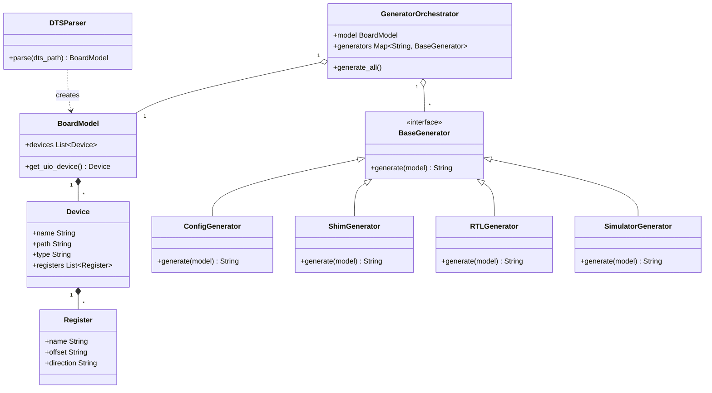

# scripts/ ARCHITECTURE_MANIFEST.md

## 1. 存在意義 (Core Value)
`scripts/` 配下のツール（主に `gen_vfpga.py`）は、抽象的なボード定義（DTS）を、具体的かつ動作可能な「ハードウェア・ソフトウェアの架け橋」へと変換する **信頼の根源（Source of Truth）** である。

## 2. 設計原則 (Design Principles)

### 2.1 DTS-Centricity (DTS至上主義)
- 全ての生成物は `config.dts` から一意に定まらなければならない。
- 生成されたソースコード（RTL, C, C++）に対する手動の修正は禁止であり、必要な変更は常に DTS または生成エンジン（Python）に対して行う。

### 2.2 Strict Decoupling (厳格な疎結合)
- **解析と生成の分離**: `DTSParser` によるパース結果は、`BoardModel` として完全に抽象化され、出力言語の構文から独立している。
- **言語ジェネレータの独立**: `BaseGenerator` を継承した各言語ジェネレータ（Config, Shim, RTL, Simulator）は、互いに依存せず独立して実装される。

### 2.3 Causality & Synchronization (因果律と同期)
- シミュレータエンジンは、ハードウェアのバスプロトコルと因果律（Causality）を尊重する。
- ソフトウェアの書き込みとハードウェアの更新は「ステートフル同期」として調停され、レースコンディションを許容しない。

## 3. アーキテクチャ階層 (Architectural Layers)

### 3.1 Parser Layer (`DTSParser`)
DTS ファイルを読み込み、意味論的な検証を行った上で `BoardModel` オブジェクトを構築する。

### 3.2 Logic Layer (`BoardModel`, `Device`, `Register`)
DTS の論理構造を抽象化したデータモデル。レジスタの属性やデバイスタイプに基づき、生成レイヤーが必要とするインテリジェンスを提供する。

### 3.3 Generation Layer (`GeneratorOrchestrator`, `BaseGenerator`)
`GeneratorOrchestrator` が `BoardModel` を各 `BaseGenerator` 実装へと配布し、一貫性のあるファイルセットを出力する。

## 4. クラス構造概略 (Class Diagram)

## 5. 開発・修正プロトコル (Protocols)

### 5.1 変更の連鎖 (Chain of Change)
1. **仕様変更**: 最初に `spec.md` または本マニフェストを更新し、設計を明確にする。
2. **モデル更新**: 変更がデータ構造に関わる場合、`BoardModel` 階層を修正する。
3. **ユニットテストの更新・実行**:
    - 変更内容をカバーするテストケースを `scripts/test_gen_vfpga.py` に追加する。
    - **義務**: `python3 scripts/test_gen_vfpga.py` を実行し、全てのテストがパスすることを確認しなければならない。
4. **ロジック更新**: 対象の `Generator` クラスを修正する。
5. **統合検証**: `run_tests.sh` を実行し、全シナリオ（01-05）の通過を確認する。

### 5.2 品質保証の義務 (Quality Assurance)
- **テスト駆動の維持**: `gen_vfpga.py` への機能追加やバグ修正を行う際は、必ずそれに対応するユニットテストをセットで提供しなければならない。
- **警告ゼロの維持**: 生成されるコードだけでなく、エンジン自体の実行時警告もゼロに保たなければならない。

### 5.3 テンプレートの純粋性
- 生成物は常に「人間が書いたかのような清潔さ（Learner-centric）」を維持しなければならない。
- エンジンのデバッグログや一時的なコメントを生成コード内に残してはならない。
