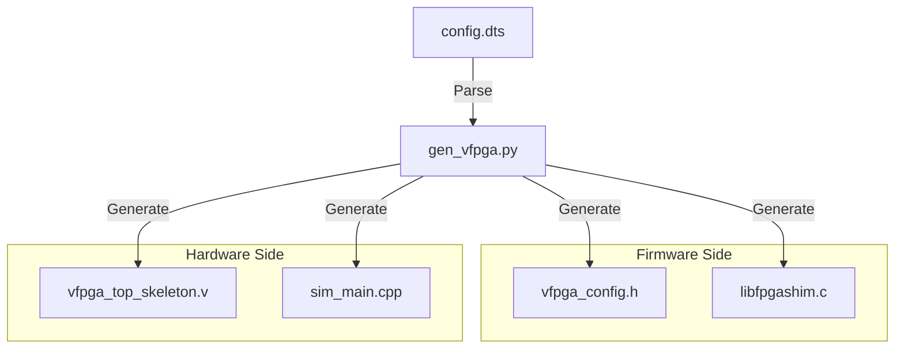

# /scripts - VirtualFPGALab 司令塔（オートメーション層）

このディレクトリには、Device Tree (DTS) からシミュレーション環境を自動構築するためのコア・スクリプトが収められています。

## 1. gen_vfpga.py (The Generator)

VirtualFPGALab の最も重要なスクリプトです。**DTSファイルを唯一の情報源 (Single Source of Truth)** とし、以下のファイルを自動生成します。

### 生成されるファイルと役割
- **`src/include/vfpga_config.h`**: 
  レジスタのアドレス、ビット幅、定数定義を含むCヘッダー。
- **`src/shim/libfpgashim.c`**: 
  LD_PRELOAD で使用するインターセプト・ライブラリ。DTSに記載されたパスやアドレスへのアクセスを自動的にフックします。
- **`src/rtl/vfpga_top_skeleton.v`**: 
  DTSの `registers` 定義に基づいた入出力ポートを備えた Verilog のトップモジュール。
- **`src/sim/sim_main.cpp`**: 
  Verilator 用の C++ ラッパー。共有メモリと RTL 信号の同期ロジックを含みます。

### データフロー図

## 2. uart_bridge.py (The Bridge)

UART（シリアル通信）のエミュレーションを担当します。

- **役割**: Shim が作成した PTY (Pseudo Terminal) デバイスを監視し、その入出力を TCP ポート（標準: 2000）へブリッジします。
- **意義**: これにより、ホストPCから Tera Term や telnet を使って、仮想FPGA上のコンソールへアクセス可能になります。

---
[README.md](../README.md) へ戻る
