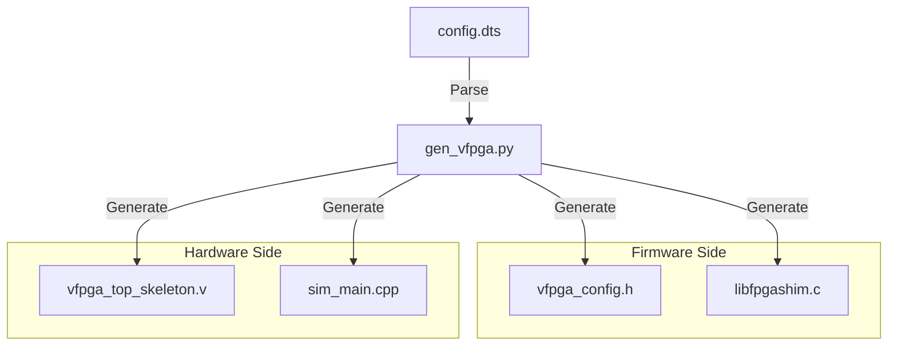

# /scripts - VirtualFPGALab 司令塔（オートメーション層）

このディレクトリには、Device Tree (DTS) からシミュレーション環境を自動構築するためのコア・スクリプトが収められています。

## 1. gen_vfpga.py (The Generator)

VirtualFPGALab の中心的なエンジンです。**DTSファイルを唯一の情報源 (Single Source of Truth)** とし、ハードウェア・ソフトウェアの境界（Shim層、RTL、シミュレータ）を自動生成します。

### 特徴
- **モジュール設計**: パーサー、データモデル、言語別ジェネレータが分離されており、容易に拡張可能です。
- **ステートフル同期**: ソフトウェアと RTL 間のレジスタ通信において、不整合（レースコンディション）を発生させない高度な同期プロトコルを実装しています。
- **環境適応性**: `/tmp` ベースの共有メモリ通信を採用しており、Docker/DevContainer などの隔離された名前空間内でも安定して動作します。

### 生成されるファイルと役割
- **`src/include/vfpga_config.h`**: レジスタマップ、ビット幅、共有メモリパスを含むCヘッダー。
- **`src/shim/libfpgashim.c`**: UIO, I2C, UART, `/dev/mem` 等のアクセスをフックし、シミュレータへリダイレクトする Shim ライブラリ。
- **`src/rtl/vfpga_top_skeleton.v`**: DTSの定義に基づいた入出力ポートを備えた Verilog のトップモジュール。
- **`src/sim/sim_main.cpp`**: Verilator 用の C++ ラッパー。共有メモリと RTL 信号の同期を司るブリッジエンジン。

### 内部構造
詳細なクラス構造や設計原則については、[ARCHITECTURE_MANIFEST.md](./ARCHITECTURE_MANIFEST.md) を参照してください。

### データフロー図


## 2. ユニットテスト

生成エンジンの信頼性を担保するため、Python コード自体のユニットテストを用意しています。

```bash
# ユニットテストの実行
python3 scripts/test_gen_vfpga.py
```

## 3. uart_bridge.py (The Bridge)

UART（シリアル通信）のエミュレーションを担当します。

- **役割**: Shim が作成した PTY (Pseudo Terminal) デバイスを監視し、その入出力を TCP ポート（標準: 2000）へブリッジします。
- **意義**: これにより、ホストPCから Tera Term や telnet を使って、仮想FPGA上のコンソールへリアルタイムにアクセス可能になります。
