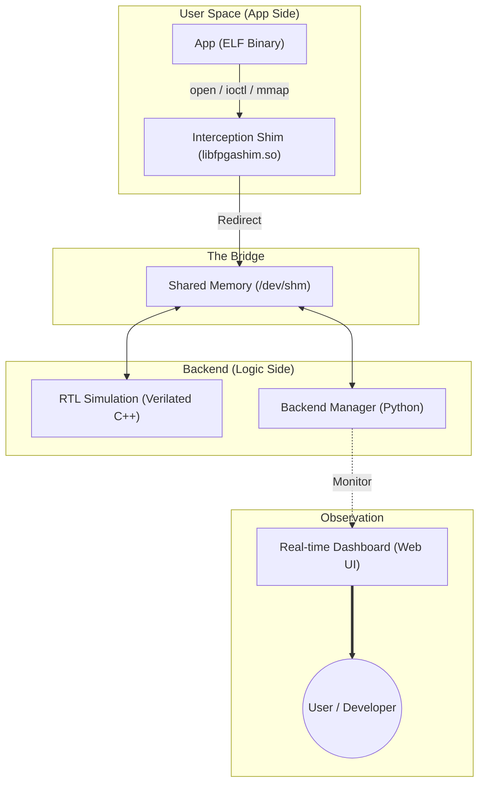

# Project: VirtualFPGALab Specification

## 1. プロジェクトの核心的意図 (Core Intent)
本プロジェクトの目的は、Xilinx Zynq等のFPGA SoC開発において、物理的なボードへの依存を最小化し、ソフトウェア・エンジニアがWSL2環境でFPGAロジックを含めた開発・デバッグを完結させることにある。
Linuxのシステムコール・フッキング技術を用いてハードウェアの振る舞いを抽象化し、「ハードウェアの完成を待ったり、高価な評価ボードを共有したりすることなく、ソフトウェアのロジック検証を回す」ことを究極の意図とする。

---

## 2. ライセンス戦略と設計モード (License Strategy)
- **Mode:** Hybrid-Bridge Mode (デフォルト適用)
- **方針:** 既存の標準的なLinuxカーネルインターフェース（uio, i2c-dev）との互換性を保ちつつ、エミュレーション・ロジック自体は完全に独立したクリーンな実装とする。

---

## 3. システム構成の整理と実機対比 (System Architecture Mapping)

本プロジェクトの仮想環境と、実際の物理ハードウェア環境の対応関係を以下に定義する。

### 3.1. コンポーネント対応表

| コンポーネント | プロジェクト内での役割 | 実機での相当品 | 物理実体 (コード/パス) |
| :--- | :--- | :--- | :--- |
| **インターセプト・シム** | システムコールを横取りする「窓口」 | **Linux カーネル・ドライバ** | `libfpgashim.so` |
| **RTL シミュレーション** | 回路ロジックを実行する「実体」 | **FPGA PL (回路)** | `obj_dir/Vcounter` |
| **バックエンド管理** | 共有メモリを確保し全体を繋ぐ | **AXI Bus / メモリマップ** | `vlogic_controller.py` |
| **ダッシュボード** | レジスタの状態を可視化する | **JTAG / ロジックアナライザ** | `dashboard_server.py` |
| **ビルド・テスト環境** | アプリの構築と動作検証 | **SDK / 評価ボード** | `Makefile`, `tests/` |

### 3.2. アーキテクチャ図 (Visual Overview)

---

## 4. 各コンポーネントの機能詳細 (Component Specifications)

### 4.1. Syscall Interceptor Layer (Shim)
- **責務:** アプリケーションが発行するデバイスアクセス（`open`, `ioctl`, `mmap`）を [LD_PRELOAD](LD_PRELOAD.md) でインターセプトし、仮想デバイスへリダイレクトする。
- **現状:** `/dev/fpga*`, `/dev/uio*`, `/dev/i2c-*` をトラップし、共有メモリまたはダミーデバイスへ誘導済み。
- **生成:** `tests/vfpga_config.dts` をソースとし、`scripts/gen_shim.py` により自動生成される。
- **意義:** Device Tree Source (FPGAのレジスタアドレスや割り込み番号等の定義) を用いたLinuxの再ビルドを必要とせず、かつアプリケーションのソースコードを一切変更せずに、FPGAの挙動をシミュレーションできる。

### 4.2. Shared Memory Register Emulator (Virtual Logic Space)
- **責務:** `/dev/shm` を用いて FPGA 上のレジスタ空間を再現する。プロセッサと回路ロジック間の「通信路」となる。

### 4.3. Logic Visualization & Diagnostic Tool (The Dashboard)
- **責務:** 共有メモリ内のレジスタ状態をリアルタイムで監視・可視化する。
- **意義:** 実機のデバッガを繋ぐことなく、ブラウザ（Port: 5000）から内部状態を把握できる。

### 4.4. RTL-C++ Integrated Bridge ([Verilator](verilator.md) Interface)
- **責務:** HDL論理を [Verilator](verilator.md) で高速な C++ モデルとして実行し、共有メモリの特定オフセットと信号を同期させる。

---

## 5. 成立条件と不変条件 (Invariants & Pre-conditions)
- **透過性:** アプリケーション層からは、通信相手が実デバイスかシミュレータかを意識させないこと。
- **完全性:** 共有メモリ上のレジスタ操作はすべてログに記録され、デバッグの再現性が担保されていること。
- **一貫性:** シミュレーション環境で作成された ELF ファイル（FW）は、そのまま実機環境へ持ち込めること。

---

## 6. 現在の進捗まとめ (Implementation Progress)
- **Phase 1-2 完了**: 開発環境構築および `LD_PRELOAD` による最小構成の Shim 動作確認。
- **Phase 3 (Advanced) 完了**:
    - [x] **I2C インターセプト**: `ioctl` フックによる通信トラップの実装。
    - [x] **Verilator 統合**: RTL モデルの C++ 化と共有メモリ同期の実現。
    - [x] **ダッシュボード構築**: リアルタイム Web UI によるレジスタ監視の実現。

---

## 7. 既知の未解決課題 (Known Open Issues)
- **割り込み通知の遅延:** WSL2上のプロセス間通信による物理割り込みとの時間的乖離。
- **マルチプロセス競合:** 同一レジスタ空間への複数アプリからのアクセス排他制御。
- **I2C 詳細エミュレーション:** 現在のダミー応答から、RTL モデルや仮想デバイスへの実データ接続への拡張。
