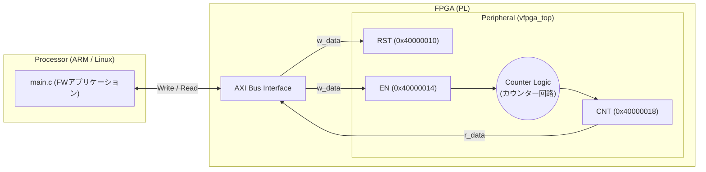

# 01_standard_uio: 基本的なレジスタアクセスの学習

このシナリオでは、FPGA/Linux開発における最も基礎的な「UIOを用いたレジスタの読み書き」を学習します。

## アーキテクチャ概念図



## ハードウェア（Verilog）の主要な信号線について

`vfpga_top.v` の冒頭にある各信号線は、ソフトウェア（C言語）からのアクセスをハードウェアのアクションに変換するための「バス・インターフェース」の役割を果たします。初学者は以下の基本信号の意味を押さえておきましょう。

- **`clk` (クロック):** ハードウェアの心臓の鼓動です。この信号が「0から1（立ち上がりエッジ）」に変化する瞬間に合わせて、すべてのレジスタ（記憶素子）が一斉に値を更新します。
- **`rst_n` (リセット):** 回路全体を初期状態に戻すための信号です。`_n` は負論理（Active Low）を意味し、「0」になった時にリセットがかかることを示します。
- **`addr[31:0]` (アドレスバス):** ソフトウェアがアクセスしようとしているレジスタの「番地」を示す32本の線です。C言語で `regs[4]` にアクセスすると、ここに **`0x40000010`**（DTS で定義された物理アドレス）が流れてきます。
- **`w_data[31:0]` (書き込みデータバス):** ソフトウェアからFPGAへ書き込みたいデータが流れてくる32本の線です。
- **`w_en` (書き込み有効 / Write Enable):** ソフトウェアが「書き込み」を行った瞬間に「1」になる制御信号です。これが「1」の時だけ、`addr`で指定されたレジスタに`w_data`の値を上書き保存します。
- **`r_data[31:0]` (読み出しデータバス):** FPGAからソフトウェアへデータを返すための線です。`addr` に応じて適切なレジスタの値をこの線に出力しておくことで、C言語側でその値を読み取ることができます。

## 学習のポイント

1. **メモリマップドI/O:** 
   C言語のポインタを使って物理メモリのアドレス（この例では `0x40000000` ベース）に直接アクセスすることで、FPGA内のレジスタ（フリップフロップ）を読み書きします。
2. **volatile修飾子:** 
   `main.c` のコードにあるように、ハードウェアレジスタへのアクセスには `volatile` を付けます。これにより、コンパイラが「この変数は外から勝手に書き換わるかもしれない」と認識し、勝手な最適化（メモリを読まずにキャッシュやレジスタを再利用する）を防ぎます。
3. **物理アドレスの識別:** 
   DTS定義でベースアドレスが `0x40000000` とされているため、RTL 側の `addr` バスには絶対アドレスが供給されます。`vfpga_top.v` では `32'h40000010` のように絶対アドレスを判定して処理を行います。
4. **UIOと割り込み（本シナリオのスコープ外）:**
   UIOには「メモリマッピング」に加えて、ハードウェアからの「割り込み通知」を受け取る強力な機能（`read()`や`poll()`で待機）があります。しかし、学習の第一歩である本シナリオでは割り込みを使用せず、レジスタへの直接アクセスと単純な待機（`sleep`等でのポーリング）のみにフォーカスしています。

## 実行方法

本ディレクトリに移動して、以下のスクリプトを実行してください。シミュレーション環境の立ち上げからアプリケーションのビルド・実行までが自動的に行われます。

```bash
./run.sh          # ビルドと実行
./run.sh --clean  # 成果物とログの削除
```
