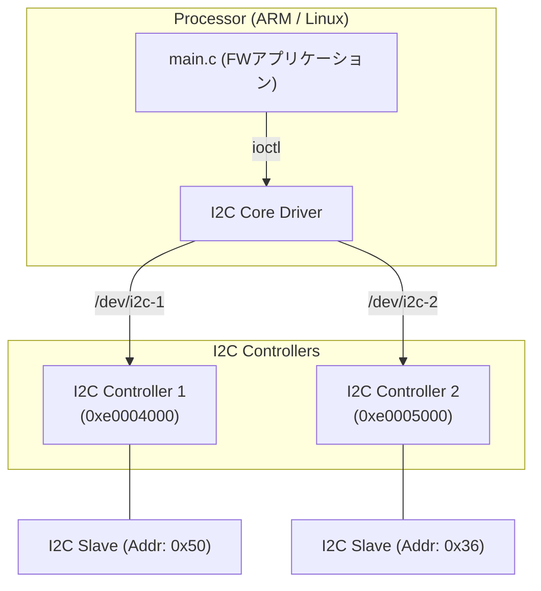

# 02_multi_i2c: 複数I2Cバスの制御と識別

このシナリオでは、Linux標準のI2Cサブシステムを使用して、システムに存在する複数のI2Cバスを制御する方法を学習します。

## アーキテクチャ概念図



## 学習のポイント

1. **デバイスノードによるバスの識別:**
   Linuxでは各I2Cバスは `/dev/i2c-1`, `/dev/i2c-2` のように個別のデバイスファイルとして抽象化されます。アプリケーションはこれらを使い分けることで、物理的に異なるバスに繋がれたデバイスを制御します。
2. **I2C_RDWR ioctl:**
   `read()` や `write()` を直接使う代わりに、`I2C_RDWR` ioctl を使用することで、開始・停止条件を含む複雑なI2Cシーケンスを1回のシステムコールでアトミックに実行できます。
3. **DTSでのバス定義:**
   `config.dts` 内で `bus_id` を定義することにより、エミュレータ上のどのコントローラがどの `/dev/i2c-X` に対応するかを決定しています。

## なぜ Verilog (.v) ファイルがないのか？

このシナリオを `01_standard_uio` と比較すると、Verilogファイルが存在しないことに気づくかもしれません。これにはハードウェア構造上の重要な理由があります。

### 1. ハードIP (PS) と ソフトIP (PL)
*   **01_standard_uio (PL側):** FPGAの回路（Programmable Logic）の中に、ユーザーが自分でロジックを配置した「自作回路」です。そのため、回路の設計図である Verilog が必要でした。
*   **02_multi_i2c (PS側):** ZynqなどのSoCにおいて、ARMプロセッサと同じシリコン上に最初から組み込まれている**「ハードIP（既製品）」**を想定しています。これは **PS (Processing System)** 側に属し、ユーザーが回路を設計・変更することはできません。

### 2. 実機開発での扱い
実際の開発でも、PS内のI2Cコントローラを使う場合は Verilog を書きません。Vivado等のツールで「I2Cを有効にする」という設定を行い、デバイスツリー（DTS）を記述するだけで、Linuxから利用可能になります。

### 3. 本プロジェクトでのシミュレーション
VirtualFPGALabにおいて、ハードIP（既製品）は Verilator による RTL シミュレーションを通さず、Python バックエンド側の **擬似デバイスモデル（モック）** が応答を担当しています。これにより、低負荷かつ高速に標準的なバス動作をエミュレートしています。

## 実行方法

本ディレクトリに移動して、以下のスクリプトを実行してください。シミュレーション環境の立ち上げからアプリケーションのビルド・実行までが自動的に行われます。

```bash
./run.sh          # ビルドと実行
./run.sh --clean  # 成果物とログの削除
```
