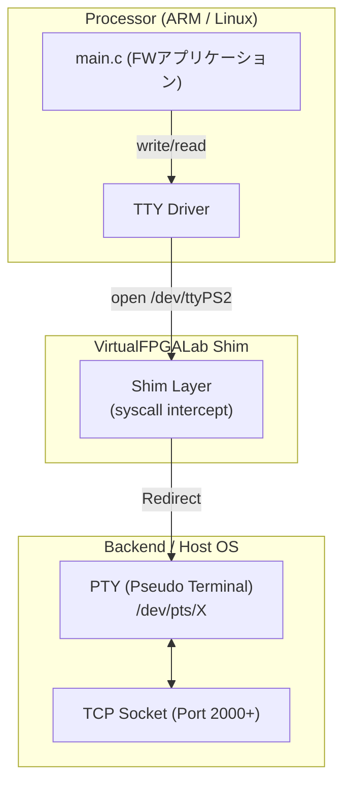

# 03_uart_console: UARTシリアルコンソールのエミュレーション

このシナリオでは、FPGAシステムで最も一般的に使用されるデバッグ・通信手段であるUART（Universal Asynchronous Receiver/Transmitter）を学習します。

## アーキテクチャ概念図

VirtualFPGALabでは、UARTデバイスへのアクセスをホストOSの「PTY（擬似端末）」へリダイレクトすることで、あたかも本物のシリアルポートに接続しているかのような操作感を提供します。



## 学習のポイント

1. **TTYデバイスとしての抽象化:**
   LinuxにおいてUARTは `/dev/ttyPS*` や `/dev/ttyS*` といった名前のキャラクターデバイスとして扱われます。
2. **標準的なファイルAPIの利用:**
   UIOでの `mmap` とは異なり、UARTは標準的な `open`, `read`, `write`, `close` を使用して通信を行います。
3. **PTYリダイレクト:**
   エミュレータ側では、書き込まれたデータをホストの仮想端末やTCPソケット（ポート2000番など）に橋渡しすることで、外部のターミナルソフト（Tera Termやminicom等）から入出力を見えるようにしています。

## なぜ Verilog (.v) ファイルがないのか？

この UART コントローラ（`xlnx,xps-uartlite-1.00.a`）は、FPGA の PL (Programmable Logic) 側に配置される「標準IP（既製品の回路データ）」として扱われます。VirtualFPGALab では、このような標準的なデバイスに対しては、システム側で自動的にエミュレーション・ロジックを割り当てるため、学習者が自分で Verilog を記述する必要はありません。

## 実行方法

本ディレクトリに移動して、以下のスクリプトを実行してください。シミュレーション環境の立ち上げからアプリケーションのビルド・実行までが自動的に行われます。

```bash
./run.sh          # ビルドと実行
./run.sh --clean  # 成果物とログの削除
```
