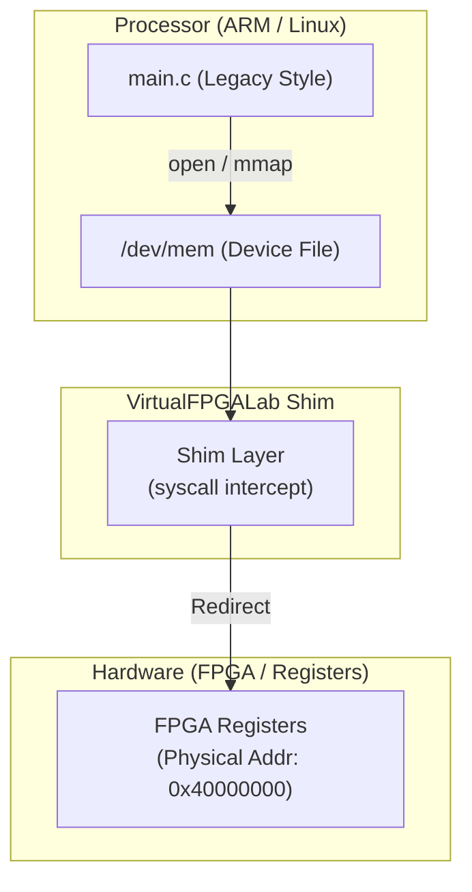

# 04_dev_mem_legacy: /dev/mem による物理メモリ直接アクセス

このシナリオでは、UIO (Userspace I/O) が普及する前によく使われていた、`/dev/mem` を介したレガシーなデバイスアクセスの手法を学習します。

## アーキテクチャ概念図

`/dev/mem` は、システム全体の「物理メモリ空間」そのものを表すキャラクターデバイスファイルです。これを開いて `mmap` することで、特定のハードウェア（FPGA等）のレジスタへ直接アクセスできます。



## 学習のポイント

1. **物理アドレスの直接指定:**
   UIOではドライバが割り当てた `/dev/uio0` 等を開きますが、`/dev/mem` 方式ではプログラム側で `0x40000000` といった**物理アドレスを直接ハードコード**して `mmap` のオフセットに指定します。
2. **権限とセキュリティ:**
   `/dev/mem` はシステムメモリ全体にアクセスできる強力なファイルであるため、通常は **root 権限** が必要です。また、間違ったアドレスへのアクセスがシステム全体をクラッシュさせるリスクがあるため、現在のLinux開発ではUIOや専用ドライバへの移行が推奨されています。
3. **レジスタアクセスマクロ:**
   組み込み開発の現場でよく見られる `readl`, `writel` といったレジスタ操作用のマクロを用いた実装例を学びます。

## なぜ Verilog (.v) ファイルがないのか？

このシナリオでは、`01_standard_uio` で作成したハードウェアをそのまま流用して、ソフトウェア（アクセス手法）だけを変更してテストしています。
- **Hardware:** `01_standard_uio/vfpga_top.v` と同じ構成
- **Software:** UIOドライバ経由ではなく、物理メモリ経由で直接アクセス

同一のハードウェアに対して、複数のソフトウェア的アプローチが可能であることを理解するのもこのシナリオの目的です。

## UIOとの比較

| 特徴 | /dev/mem (Legacy) | UIO (Modern Standard) |
|:---|:---|:---|
| **指定方法** | 物理アドレスを直接指定 | デバイス名 (`/dev/uioX`) を指定 |
| **安全性** | 低い (全メモリが見えてしまう) | 高い (許可された領域のみ) |
| **割り込み** | 扱えない | 扱える |
| **推奨度** | デバッグ・レガシー用途 | 本番・推奨 |

## 実行方法

本ディレクトリに移動して、以下のスクリプトを実行してください。シミュレーション環境の立ち上げからアプリケーションのビルド・実行までが自動的に行われます。

```bash
./run.sh          # ビルドと実行
./run.sh --clean  # 成果物とログの削除
```
