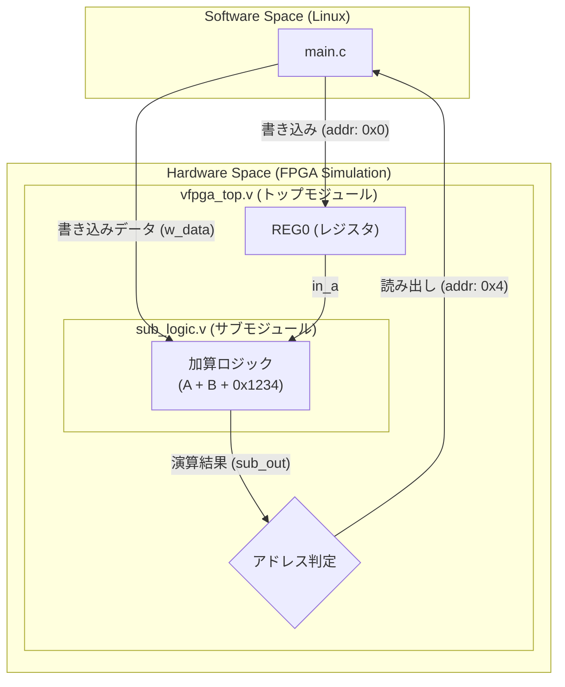

# Scenario 05: 複数 Verilog ソースファイル構成のサポート

## 概要
このシナリオでは、VirtualFPGALab が複数の Verilog ソースファイル (`.v`) を持つ構成に対応していることを学習します。大規模な回路を機能単位で分割して設計する、実戦的な FPGA 開発の手法を体験します。

## アーキテクチャ概念図

このシナリオでは、ソフトウェアからの入力を受け取る「トップモジュール」と、実際の演算を担う「サブモジュール」が、物理的に別のファイルとして定義されています。

## 学習のポイント
1. **モジュール分割**: 回路設計において、機能を別ファイル（サブモジュール）に切り出す手法とその利点。
2. **インスタンス化**: `vfpga_top.v` から `sub_logic.v` を呼び出し、ポートを接続（結線）する手順。
3. **自動収集ビルド**: `scenario_runner.sh` がディレクトリ内の全ての `.v` ファイルを自動的に Verilator へ渡す仕組み。

## ハードウェア構成
- **Top Module (`vfpga_top.v`)**:
    - `addr 0x0`: `REG0` への書き込み。
    - `addr 0x4`: サブモジュール `sub_logic` の出力を読み出し。
- **Sub Module (`sub_logic.v`)**:
    - `out_y = in_a + in_b + 0x1234` という単純な加算ロジック。

## 実行結果の期待値
`main.c` が `REG0` に値を書き込み、オフセット `0x4` を読み出した際、サブモジュールの演算結果（非ゼロ）が返ってくれば成功です。
