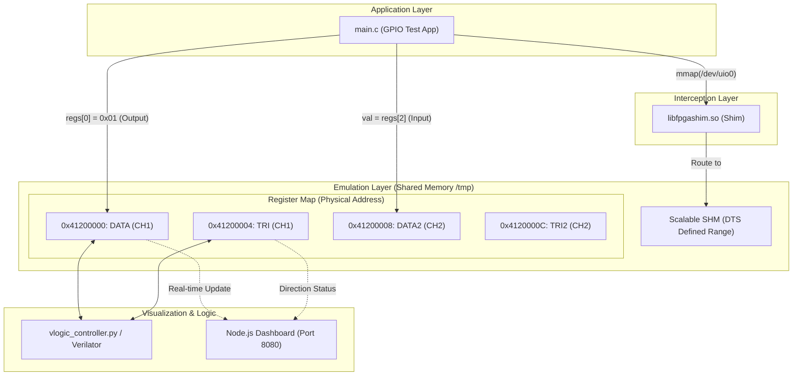

# Scenario 06: AXI GPIO

このシナリオでは、Zynq等のFPGAでよく利用される `AXI GPIO` (General Purpose Input/Output) のエミュレーション機能のテストを行います。

## アーキテクチャ概念図

## 構成

- **`config.dts`**: AXI GPIOのデバイスツリー定義 (`xlnx,xps-gpio-1.00.a`) が含まれています。ベースアドレス `0x41200000` に配置され、DATA, TRIなどの基本的なレジスタが定義されています。
- **`main.c`**: GPIOレジスタに対してmmapを行い、チャネル1を出力、チャネル2を入力として設定してテストを行うC言語のアプリケーションです。DTS で定義された物理アドレスを基準にアクセスを行います。
- **Dashboard**: Node.jsダッシュボード側で、GPIOの状態（入力・出力ピンの値）を視覚的に確認・操作するための機能拡張のテストにも使用されます。

## 学習のポイント

1.  **UIO経由のレジスタアクセス**: `/dev/uio0` を通じて、物理アドレス `0x41200000` のレジスタをどのように操作するかを学びます。RTL 側のアドレスバス (`addr`) にもこの絶対アドレスが流れます。
2.  **TRIレジスタの役割**: GPIOのピンが「入力」か「出力」かを、`TRI` レジスタの設定によって切り替える AXI GPIO 特有の挙動を確認します。
3.  **リアルタイム可視化**: ソフトウェアによるレジスタ書き込みが、即座にダッシュボード上のLEDインジケーター（緑色：出力、青色：入力）に反映される様子を観察します。
