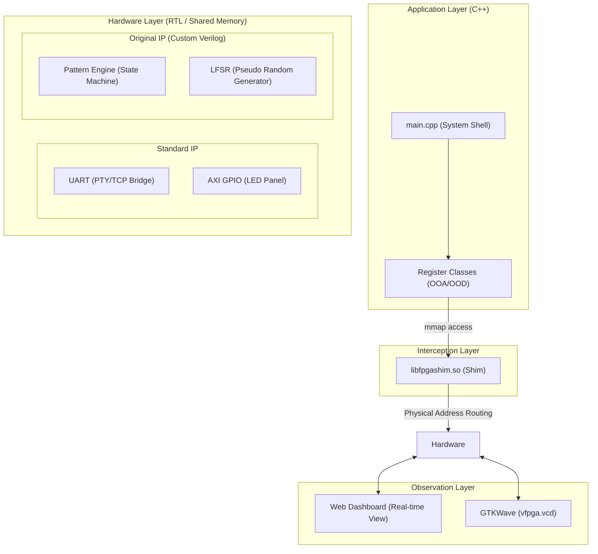
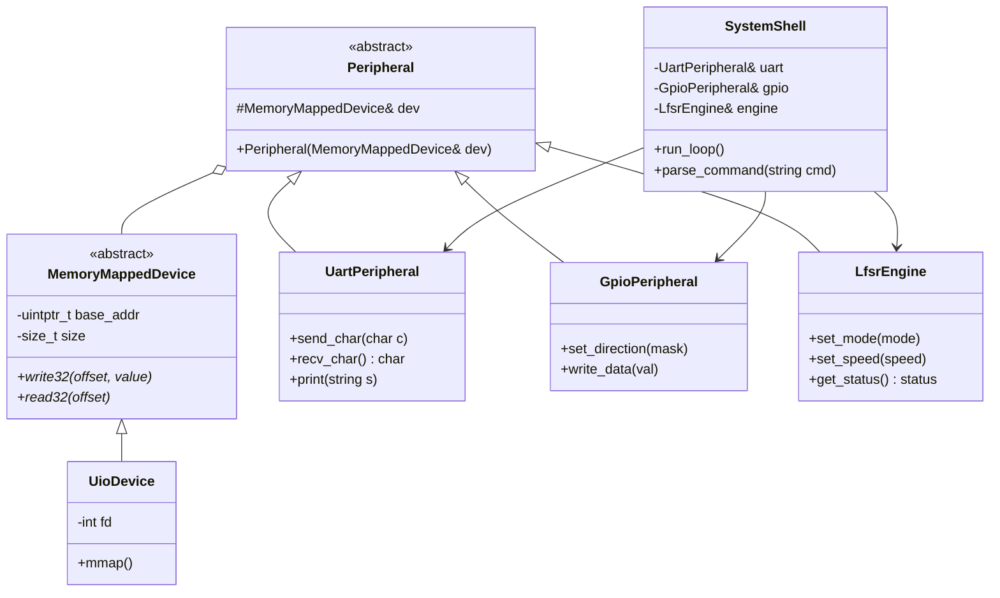

# Scenario S01: C++ LFSR シーケンサー・ショーケース

このシナリオは、VirtualFPGALabの主要なエミュレーション機能（レジスタI/O、UART通信、GPIO操作、およびRTL統合シミュレーション）を組み合わせた「システム統合ショーケース」です。標準的なペリフェラルに加え、独自に設計された「カスタムRTLモジュール」をC++アプリケーションから統合的に制御する、実機さながらのシステム開発を体験します。

## システムアーキテクチャ概念図

## ファームウェア設計（C++ クラス図）

ファームウェアは、ハードウェアの依存関係を抽象化した疎結合な設計を採用しています。

## このシナリオの見どころ

### 1. モダン C++ によるハードウェア抽象化
FW側を C++17 で実装します。低レイヤなアドレス操作をクラスとしてカプセル化し、`engine.set_mode(Mode::LFSR)` や `engine.set_speed(5)` のような直感的なコードでハードウェアを操作する、プロフェッショナルな組み込みソフトウェアの設計パターンを示します。

### 2. 自律型カスタムRTL「Pattern Engine」
単なる「値の保持」ではない、独自のロジックを持つVerilogモジュールを搭載しています。
- **Autonomous Sequencer**: CPUからの指示を受けると、ハードウェア側のステートマシンが独立してLEDパターンを生成します。
    - **Sequential**: LEDが流れるように点灯します。
    - **Binary Count**: 8bitバイナリカウンタとして動作します。
    - **LFSR Random**: **線形帰還シフトレジスタ（LFSR）**を用いた擬似乱数生成を行い、回路ロジックのみでランダムな点滅パターンを作り出します。
- **Observation Focus**: GTKWaveを用いることで、LFSRのフィードバック回路（XOR）がクロックごとにビットを変化させる「ハードウェアの計算」を目の当たりにできます。

### 3. UART 対話型シェル
TCPブリッジ（ポート2000）を介して、実行中のシステムと対話できます。
- `help`: コマンド一覧を表示。
- `status`: システム稼働時間と現在のステート（LFSR値など）を取得。
- `mode [seq/bin/lfsr/off]`: 動作モードをリアルタイムに切り替え。
- `speed [1-10]`: ハードウェア側の更新速度をレジスタ経由で変更します。内部的には、シミュレーションサイクル（~10kHz）に対して `(11-speed) * 1000` サイクルごとに RTL の状態を更新する設計になっており、スピード「10」で最も速く点滅します。

## 構成ファイル

- **`config.dts`**: UART, GPIO, およびカスタムエンジン（Pattern Engine）の定義。
- **`vfpga_top.v`**: 全体のバス配線。
- **`pattern_engine.v`**: ステートマシン、LFSR、分周器を実装したオリジナルモジュール。
- **`main.cpp`**: C++による統合制御アプリケーション。

## 学習のポイント

1.  **システム統合**: 複数の異なるデバイスを一つのアドレス空間で同時に扱う方法。
2.  **HW/SWの責務分離**: 「複雑なシーケンス生成」や「ロジックによる乱数生成」をハードウェア（RTL）に任せ、ソフトウェアは管理（モード切替）を行う設計思想。
3.  **シミュレーションの力**: LFSRのような物理的なビット操作を、GTKWaveで1クロック単位でデバッグ・観察する体験。
